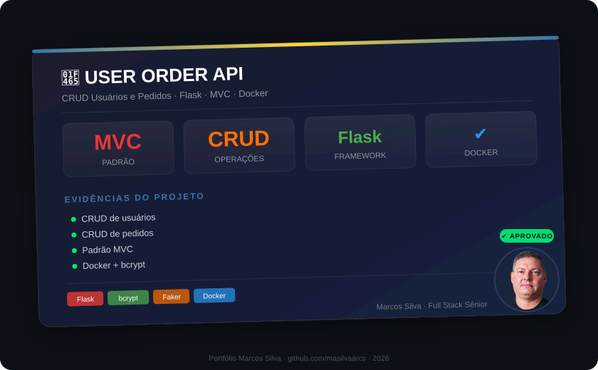

# User Order API Flask

API REST para gerenciamento de usuários e pedidos, construída com Flask seguindo o padrão MVC.

## Funcionalidades

- **CRUD de Usuários**: Listar, adicionar, atualizar e remover usuários
- **CRUD de Pedidos**: Listar e adicionar pedidos vinculados a usuários
- **Dados dinâmicos**: 20 usuários gerados automaticamente via Faker a cada execução
- **Segurança**: Senhas armazenadas com hash bcrypt (nunca em texto puro)
- **Docker**: Dockerfile pronto para containerização
- **Testes**: Suíte de testes com pytest

## Stack

- Python 3.9+
- Flask 2.3
- bcrypt (hashing de senhas)
- Faker (geração de dados realistas pt-BR)
- pytest + pytest-flask (testes)
- Docker

## Estrutura do Projeto

```
user-order-api-flask/
├── src/
│   ├── app.py                  # Aplicação Flask principal
│   ├── controllers/
│   │   ├── user_controller.py  # Lógica de negócio de usuários
│   │   └── order_controller.py # Lógica de negócio de pedidos
│   ├── models/
│   │   ├── user_model.py       # Modelo User (dataclass)
│   │   └── order_model.py      # Modelo Order
│   └── views/
│       ├── user_view.py        # Rotas/Blueprints de usuários
│       └── order_view.py       # Rotas/Blueprints de pedidos
├── tests/
│   ├── conftest.py             # Fixtures compartilhadas
│   ├── test_users.py           # Testes de usuários
│   └── test_orders.py          # Testes de pedidos
├── .gitignore
├── .dockerignore
├── Dockerfile
├── docker-compose.yml
├── requirements.txt
├── LICENSE
└── README.md
```

## Início Rápido

### Instalação Local

```bash
# Clonar o repositório
git clone https://github.com/masilvaarcs/user-order-api-flask.git
cd user-order-api-flask

# Criar e ativar ambiente virtual
python -m venv venv
venv\Scripts\activate        # Windows
# source venv/bin/activate   # Linux/macOS

# Instalar dependências
pip install -r requirements.txt

# Executar a API
python src/app.py
```

A API estará disponível em `http://localhost:5000`.

### Docker

```bash
# Build e execução com docker-compose
docker-compose up --build

# Ou manualmente
docker build -t user-order-api-flask .
docker run -p 5000:5000 user-order-api-flask
```

## Endpoints

### Usuários

| Método | Endpoint | Descrição |
|--------|----------|-----------|
| GET | `/users/` | Lista todos os usuários |
| GET | `/users/<id>` | Obtém usuário por ID |
| POST | `/users/` | Cria novo usuário |
| PUT | `/users/<id>` | Atualiza usuário |
| DELETE | `/users/<id>` | Remove usuário |

#### Exemplo: Criar Usuário

```bash
curl -X POST http://localhost:5000/users/ \
  -H "Content-Type: application/json" \
  -d '{
    "name": "João Silva",
    "phone": "+55 11 98765-4321",
    "street": "Rua das Flores, 123",
    "city": "São Paulo",
    "neighborhood": "Jardim das Acácias",
    "zip_code": "01234-567",
    "state": "SP",
    "email": "joao@example.com",
    "password": "suaSenhaForteAqui"
  }'
```

#### Resposta (201 Created)

```json
{
  "user_id": 21,
  "name": "João Silva",
  "phone": "+55 11 98765-4321",
  "street": "Rua das Flores, 123",
  "city": "São Paulo",
  "neighborhood": "Jardim das Acácias",
  "zip_code": "01234-567",
  "state": "SP",
  "email": "joao@example.com"
}
```

> Nota: O campo `password` nunca é retornado nas respostas.

### Pedidos

| Método | Endpoint | Descrição |
|--------|----------|-----------|
| GET | `/orders/` | Lista todos os pedidos |
| POST | `/orders/` | Cria novo pedido |

#### Exemplo: Criar Pedido

```bash
curl -X POST http://localhost:5000/orders/ \
  -H "Content-Type: application/json" \
  -d '{"user_id": 1, "item": "Notebook"}'
```

## Testes

```bash
# Executar todos os testes
pytest tests/ -v

# Com relatório de cobertura
pytest tests/ -v --cov=src --cov-report=term-missing
```

## Origem

Este projeto é uma versão refatorada e melhorada do repositório original
[SimpleUserOrderAPI](https://github.com/masilvaarcs/SimpleUserOrderAPI).

### Melhorias aplicadas

- `.gitignore` completo para Python
- `.dockerignore` para builds otimizados
- `docker-compose.yml` para deploy simplificado
- `conftest.py` com fixtures compartilhadas nos testes
- Correção de testes (campos corretos, fixtures isoladas)
- Pinagem de versões no `requirements.txt`
- README profissional com exemplos práticos

## Licença

Este projeto é licenciado sob a [MIT License](LICENSE).

## 📸 Evidências

<p align="center">
  
</p>

